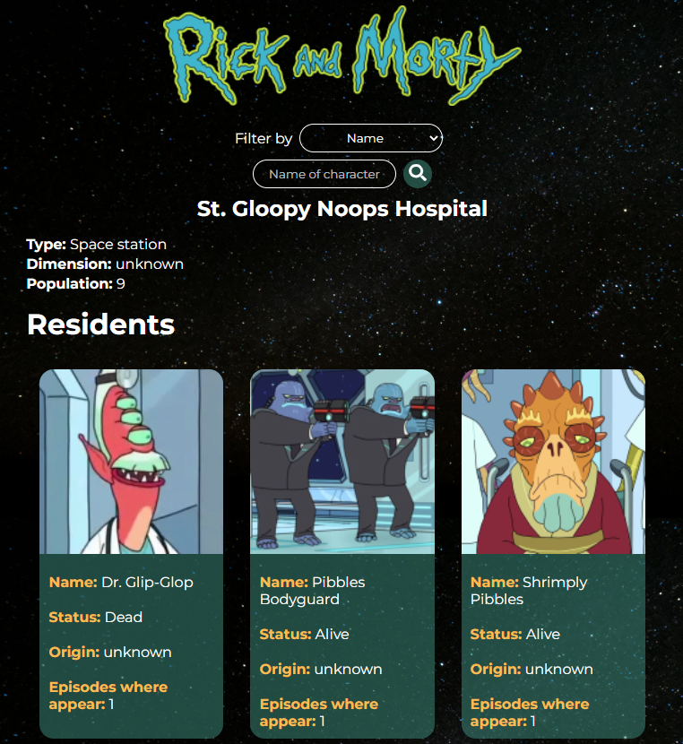
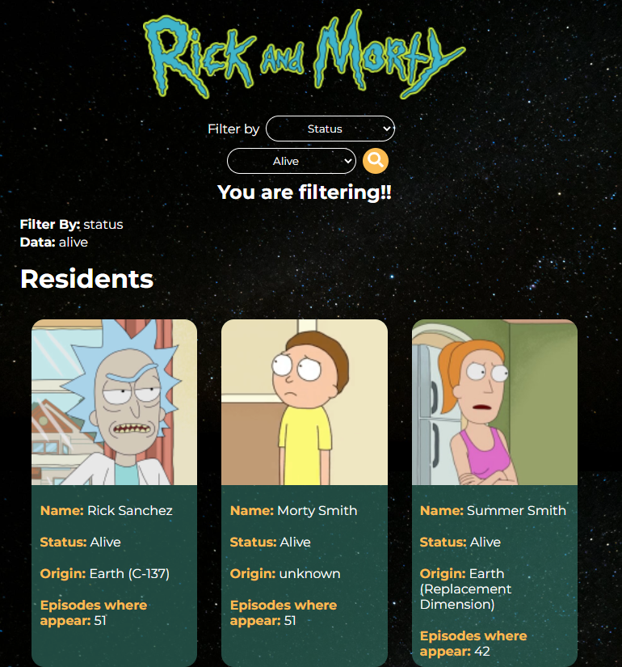

# Rick and Morty App

Aplicación sobre la serie animada Rick y Morty. Cuando inicias la app te mostrará tarjetas de personajes aleatorios según una ubicación (también aleatoria), luego podrás filtrar por nombre, estado, especie y género y navegar entre páginas cuando poseemos demasiados personajes. Las tarjetas de cada personaje trae información sobre su nombre, estado, origen y episodios donde apareció. Es importante reconocer que esta App consume los datos de la siguiente API: https://rickandmortyapi.com/

## Deploy

https://rick-and-mortyngg.netlify.app/

## Inicia el proyecto

Si desea ver el proyecto localmente, debes clonar e instalar las dependencias para ver correctamente la App.

## Instación

### `npm install`

En el directorio del proyecto, debe usar npm i y esperar la instalación de los siguientes programas:

<ul>
  <li>react</li>
  <li>axios</li>
  <li>sweetalert</li>
</ul>

## Inicio

### `npm start`

En el directorio del proyecto, debe usar npm start y se abrirá http://localhost:3000 en una pestaña de tu navegador predeterminado.

  
  

Si tienes alguna sugerencia o comentario escribeme a mi correo o a mi perfil de linkedin y con gusto lo tomare en cuenta!!

LinkedIn: https://www.linkedin.com/in/nicolasggdev/

E-mail: nicolasggdev@gmail.com

# Rick and Morty App

Application about the animated series Rick and Morty. When you start the app it will show you random character cards according to a location (also random), then you can filter by name, status, species and gender and navigate between pages when we have too many characters. The cards of each character bring information about his name, status, origin and episodes where he appeared. It is important to recognize that this App consumes data from the following API: https://rickandmortyapi.com/

## Deploy

https://rick-and-mortyngg.netlify.app/

## Start the project

If you want to view the project locally, you must clone and install the dependencies to properly view the App.

## Install

### `npm install`

In the project directory, you need to use npm and wait for the installation of the following programs:

<ul>
  <li>react</li>
  <li>axios</li>
  <li>sweetalert</li>
</ul>

## Start

### `npm start`

In the project directory, you should use npm start and it will open http://localhost:3000 in a tab of your default browser.

  
  

If you have any suggestions or feedback, write to my email or my linkedin profile and I will gladly take it into account!!

LinkedIn: https://www.linkedin.com/in/nicolasggdev/

E-mail: nicolasggdev@gmail.com
